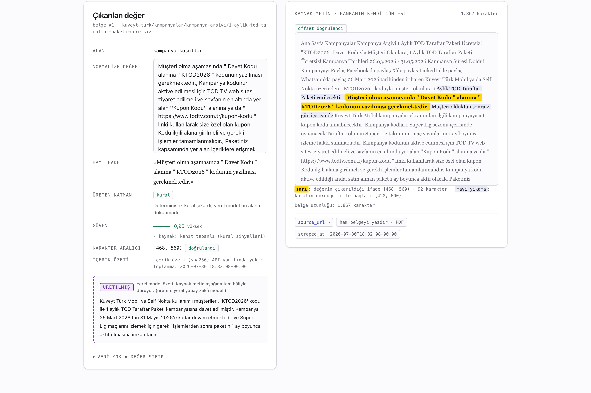

<div align="center">

# Anatolia AI

### Katılım Bankacılığı Kampanya Metinlerinden Finansal Bilgi Çıkarımı

**TEKNOFEST 2026 — Türkçe Yapay Zekâ Dil Ajanları Yarışması · 2. Senaryo**
Yürütücü: **Bilişim Vadisi**

[](https://github.com/mehmetefeaytas/anatoliaAI/actions/workflows/ci.yml)
[](app/LICENSE)
[](app/tests/)
[](app/eval/properties.py)
[](app/docs/OFFLINE-KANIT.md)
[](https://huggingface.co/datasets/mehmetefeaytas/katilim-bankaciligi-kampanya-gold)
[](app/docs/sbom.json)

**Yarışma etiketleri:** `BilisimVadisi2026` · **Türkiye Açık Kaynak Platformu**

</div>

---

Anatolia AI, Türkiye'deki katılım bankalarının (faizsiz finans) resmî
sitelerindeki kampanya ve ürün metinlerinden finansal bilgiyi çıkarıyor; bu
bilgiyi normalize ediyor, sınıflandırıyor ve bankalar arasında karşılaştırıyor.
Sonucu bir dashboard ve iki yollu (yapısal sorgu ↔ RAG) bir chatbot ile
sunuyor. Tamamı açık kaynak (Apache-2.0); on-premise ve internetsiz çalışıyor.

> 2.708 gerçek belge · 10/10 katılım bankası · 999 PDF · 3.552 yeşil test ·
> ağsız kanıt: tek konteyner 14/14, tam yığın **3/3 koşum · 39/39 adım** ·
> yayımlanmış altın veri seti

**Üretim yolu kural tabanlıdır — ve bu ölçülmüş bir karardır.** LLM katmanı
kodda var, koşuyor ve ölçüldü; ölçüm onu üretime almamayı söyledi.

İki bağımsız ölçüm, iki ayrı donanım, aynı sonuç. Birincisi CPU'da üç
konfigürasyon: üçü de kural katmanının altında kaldı (McNemar p = 0,00105 /
0,00050 / 0,0000123) ve hibrit kol halüsinasyonu **2,4 katına** çıkardı
(0,0425 → 0,1029). İkincisi A100'de **sekiz hücre** — iki model
(`qwen2.5:7b`, `qwen3.5:9b`) × iki sorgu granülaritesi × iki gold seti:
**sekizinin sekizi de** kabul kapısından geçemedi.
(`qwen3.5:9b` yalnız bu ablasyonda ikame olarak koştu, üretim yolunda yok;
adın Alibaba numaralandırmasındaki karşılığı doğrulanamadı — çekince ve
digest'ler: [`app/docs/model-lisanslari/README.md`](app/docs/model-lisanslari/README.md).)

İki hipotezi de kendimiz kurup kendimiz çürüttük. Daha büyük model daha iyi
değil, daha cesur: 9B halüsinasyonu tabanın **4,2 katına** çıkardı. Modele tek
çağrıda tek alan sormak da işe yaramadı — hata "yanlış kutuyu seçmek" değil,
"boş kalması gereken kutuya bir şey yazmak". İki gold'da LLM'in kazandırdığı
doğru değer **6**, getirdiği yanlış pozitif **23–60**.

LLM sağlığı da ölçüldü: ablasyon koşumunda 384 çağrının 384'ü geçerli yanıt
verdi; tüm sağlık günlüğünde (4.472 çağrı kaydı) yalnız 10 arıza var — 9 kesik
yanıt, 1 bağlantı kopması, sıfır şema ihlali. Düşük başarım teknik bir arıza
değil. Şartname ablasyon tablosu istiyor; bizimki hibridin
kazanmadığını gösteriyor ve öyle yayımlandı →
[ablasyon raporu](app/docs/rapor/ablasyon.md) ·
[8 hücrelik ölçüm](app/docs/rapor/llm-uretim-devreye-alma.md).

### 🔬 Gold setin güvenilirliği — jürinin ilk sorusu, ilk ekranda

| ne | değer | durum |
|---|---|---|
| **κ — ikinci etiketleyici turu** (gold.v2 ↔ LLM-01, 192 çift) | **0,714** | **notla kabul** — önceden ilan edilmiş 0,67 ≤ κ < 0,80 bandı |
| κ — round0 kalibrasyon (Fleiss, 4 anotatör, 260 satır) | 0,302 | eşik altı → ilan edilen sonuç **uygulandı** (kılavuz v1→v2) |
| κ — round1 (Cohen, 141 ortak karar, hakemlik öncesi) | 0,274 | eşik altı → zorunlu hakemlik **koştu** |
| İkinci etiketleyici kim | **bir LLM** (`qwen2.5:7b-instruct`) — ve ayrıca **bir İNSAN** | insan turu **koştu**: κ 0,716, LLM turuyla fark 0,002. Körleme kod düzeyinde garanti (`ikinci_etiketleyici.py` gold/LLM değerini parametre olarak bile almıyor) |
| HAKEM turları | **5 tur** koştu; gold + kılavuz + motor **üç katmanda birden** düzeltildi | bedeli raporlanıyor (bkz. §4). HAKEM-05'te 23 vakanın 18'inde gold, 1'inde motor yanlıştı |

Eşik tablosu anotasyon **başlamadan** ilan edildi (`ANNOTATION_GUIDE.md` §7);
ölçülen κ'ya bakıp eşik değiştirilmedi. `masraf_durumu` alanında κ **negatif**
çıktı (−0,103) ve bu gizlenmedi — hakemlendi, kök neden kılavuzun kapsam
kuralında bulundu ve düzeltmenin **F1'e maliyeti** yayımlandı.
Üreten komut: `python -m scripts.ikinci_etiketleyici kappa`
· ayrıntı [`_kappa-ikinci-tur.md`](app/data/gold/review/_kappa-ikinci-tur.md).

---

## 🎯 Proje Tanımı

Katılım bankacılığında bilgiler doğal dilde, dağınık ve kıyaslanması zor biçimde
sunulur: "ilk 6 ay masrafsız", "%1,99–%2,49 arası kâr payı", "120 aya kadar
vade". Anatolia AI bu metinleri makine tarafından okunabilir, karşılaştırılabilir
yapısal veriye dönüştürür.

| # | Aşama | Ne yapar |
|---|---|---|
| 1 | Toplama | Banka sitelerinden kampanya metinleri (config-driven, robots.txt uyumlu, provenance'lı) |
| 2 | Bilgi çıkarımı | **Kural katmanı** (üretimde tek etkin katman): kâr payı oranı, tutar, vade, taksit, masraf, tarih… LLM kolu mimaride var, üretimde kapalı — gerekçe ölçüm |
| 3 | Normalizasyon | TR sayı/oran/para/vade/tarih biçimleri tek kanonik biçime (`%1,89` → `1.89`, `1.500,00` → `1500.00`, `12 ay` → `12`) |
| 4 | Sınıflandırma | 8 kampanya türü (Konut/Taşıt/İhtiyaç Finansmanı, Kart, Alışveriş Puanı, Yeni Müşteri, Yatırım Ürünü, Finansman) |
| 5 | Karşılaştırma | Bankalar arası adil kıyas ve çelişki tespiti |
| 6 | Sunum | Next.js dashboard + router'lı chatbot: yapısal sorgu (text-to-SQL) ↔ RAG |

### Somut örnek — bir kampanya cümlesi, üç yapısal alan

Girdi, Kuveyt Türk'ün bir alışveriş finansmanı kampanyasının açılışı
(`clean_text[57:334]`, belge #294):

> Taksitlio'da Yeni Müşterilere Özel Kuveyt Türk Alışveriş Finansmanı Fırsatı!
> Taksitlio'nun anlaşmalı olduğu mağazalarda yapacağınız alışverişlerinizde yeni
> müşteriye özel %2,99 kar payı oranlı Taksitlio Alışveriş Finansmanı sizlerle!
> Kampanya Tarihleri 20.01.2026 - 31.12.2026

Bu alıntıdan çıkan alanlar (belgenin tamamı altı alan veriyor; kalan üçü metnin
ilerleyen kısmından):

| Alan | Ham ifade | Kanonik değer | Güven | Katman | Kaynak aralığı |
|---|---|---|---|---|---|
| `hedef_kitle` | «Yeni Müşteri» | `["yeni_musteri"]` | 0,95 | kural | `[70, 82]` |
| `kar_payi_orani` | «%2,99» | `2.99` | 0,95 | kural | `[228, 233]` |
| `kampanya_suresi` | «20.01.2026 - 31.12.2026» | `"2026-12-31"` | 0,72 | kural | `[310, 333]` |

Üç aralığın üçü de `verify_span()` denetiminden geçiyor: `clean_text[start:end]`
ham ifadeye birebir eşit. Kanonik biçim farkına dikkat: oran virgüllü metinden
noktalı ondalığa, tarih aralığı ISO-8601 bitiş tarihine dönüyor. Kampanya
süresinin güveni (0,72) diğerlerinden düşük, çünkü tek tarihe indirgenen bir
aralıktan geliyor.

Kaynak: `data/demo.db` · üreten komut `python -m src.extraction.run`

### Ürün ekranı — her değer kaynağına bağlı



Ekranın tezi şu: solda bir değer görüyorsanız, sağda o değeri doğuran cümle zaten
açık — ayrı bir tıklama gerekmez. Vurgu iki katmanlıdır: sarı, değerin
çıkarıldığı ifade; mavi yıkama, kuralın gördüğü cümle bağlamı. Ölçülemeyen alan
boş bırakılıyor ve boşluğun kendisi sayılıyor.

Altı ürün sekmesinin ve beş denetim ekranının tamamı için 42 ekranlık görsel tur:
[`docs-ekran/anatolia-ai-panel-ekranlari.pdf`](docs-ekran/anatolia-ai-panel-ekranlari.pdf)
(45 sayfa, her ekranın altında ne işe yaradığı yazılı).

### 🏗️ Mimari

```
                    ┌──────────────────────────────────────────┐
  banka siteleri ──▶│  scrape (config-driven) → clean → TR ön  │
                    │  işleme                                   │
                    └────────────────────┬─────────────────────┘
                                         ▼
                    ┌──────────────────────────────────────────┐
                    │  ÇIKARIM — "önce kural, sonra LLM"        │
                    │  ① kural/regex  (birincil, deterministik) │
                    │  ② LLM + guided_json (yalnız boşluklar)   │
                    │  → reconcile: kural kazanır, LLM doldurur │
                    └────────────────────┬─────────────────────┘
                                         ▼
   normalize (kanonik) ──▶ PostgreSQL/SQLite ──▶ compare & rank
                                         │
                          ┌──────────────┴──────────────┐
                          ▼                             ▼
                    Next.js dashboard          hibrit chatbot
                    (kanıt vurgulamalı)     (router: SQL │ RAG)
```

- **Kural/Regex (birincil, deterministik):** sayısal ve yapısal alanlar.
- **Yerel LLM + `guided_json`:** yalnızca örtük ya da bulanık ifadeler için.
  Serbest metin hiçbir yerde parse edilmiyor.
- **Halüsinasyon yasağı:** bilgi yoksa sistem `null` ve düşük güven döndürür,
  değer uydurmaz. `eval/properties.py` ve CI kapısı bunu denetliyor.

> **Teslim edilen katman sayısı: iki.** Planlanan üçüncü katmanı (NER) teslim
> etmedik. GLiNER projeye hiç girmedi; BERTurk eğitildi, ölçüldü ve kabul
> kapısını geçemedi. Belgeler bunu yazıyor (`src/extraction/reconcile.py` modül
> başlığı).

---

## 📊 Ölçülebilir Durum

Bu tablodaki her sayı yanındaki komutla yeniden üretilebilir ve bir CI kapısına
bağlı: `python -m scripts.kanit_tazeligi` her satırı üreten kanıtla
karşılaştırır, ayrışırsa CI düşer. Ölçüm tarihi: **21 Ağustos 2026**, temiz
ağaçta (`app/eval/reports/20260821-182450/` gold.v2 ve `.../20260821-182525/`
gold.round1) · ölçüm kolu: `kural` (resmî varsayılan, LLM kapalı).

| Ne | Değer | Üreten komut |
|---|---|---|
| Banka (config-driven) | **10 katılım bankası** + TKBB (şemsiye kuruluş) | `config/banks.yaml` |
| Korpus | **2.708 belge** (ham arşivle eşit) · 7.022 çıkarılan alan — kurulum betiği güncel kodla bu sayıları üretir | `python -m scripts.check_demo_db` |
| AI özeti kapsaması | **2.634 üretildi (%97,3)** · 74 belge gerekçeli boş (29 metin boş · 41 terminoloji kapısı · 4 diğer) | `python -m scripts.build_summaries --db data/demo.db --devam` |
| Gold — zor vaka seti | gold seti: `gold.v2.json` (48 kayıt), 40'ı kasten zor | `data/gold/gold.v2.json` |
| Gold — geniş örneklem | `gold.round1` \| 134 \| protokol v2, 38'i hakemlikten geçti | `python -m scripts.build_gold --pre data/gold/preannotations.v2.json --csv data/gold/review/round1_{A,B}.csv --csv data/gold/review/round1_main_{C,D}.csv` |
| **gold.round1 mikro-F1** | **0,795** · halüsinasyon **0,284** · makro **0,650** — HAKEM-05 sonrası (öncesi 0,738 / 0,344) | `python -m eval.run_eval --gold data/gold/gold.round1.json` |
| gold.round1 `finansman_tutari` | **F1 1,000** (P 1,0 · R 1,0 · TP 18 · FP 0) — öncesi 0,500. **Destek 22 → 18:** artışın bir kısmı ölçümün DARALMASINDAN geliyor; kaldırılan hücreler finansman tutarı DEĞİLDİ (temassız limit, mevduat limiti, vade kademesi eşiği) | *(aynı komut)* |
| Yapılandırılmış alan mikro-F1 (gold.v2, 11 alan) | **0,8228** | `python -m eval.run_eval --gold data/gold/gold.v2.json` |
| 12-alan mikro-F1 | **0,5702** *(ikili ölçüt — hedef 0,60'ın ALTINDA)* | *(aynı komut — farkı aşağıda açıklıyoruz)* |
| Kalem düzeyi mikro-F1 (12 alan) | **0,6291** | *(aynı komut)* |
| makro-F1 | **0,7646** | *(aynı komut)* |
| Halüsinasyon oranı | **0,0336** · yapısal kesitte 0,0254 | *(aynı komut)* |
| RAG — terim kapsama R@5 | 0,867 | `python -m eval.rag_eval --db data/demo.db` |
| RAG — banka hedefleme R@5 | 0,800 (BM25 sıralama) | *(aynı komut)* |
| RAG — kaynak gösterme oranı | 1,000 | *(aynı komut)* |
| Reddetme kararı doğruluğu | 30/30 = 1,000 | *(aynı komut)* |
| Güvenlik seti | 29/30 = 0,97 · aşırı red 0/6 | `python -m src.chatbot.run_safety_eval --db data/demo.db` |
| Anotatör uyumu — **v2 turu** | **Cohen κ 0,714** (192 çift, ikinci etiketleyici LLM — "notla kabul") | `python -m scripts.ikinci_etiketleyici kappa` |
| Anotatör uyumu — **İNSAN turu** | κ (İNSAN) = **0,716** (aynı 16 kayıt, ikinci etiketleyici bir İNSAN; LLM turuyla fark **0,002** → LLM varlık kararında geçerli vekildi, değer uyumunda değil: 0,423 ↔ 0,750) | `python -m scripts.ikinci_etiketleyici kappa --girdi data/gold/review/ikinci-tur-insan.jsonl` |
| Anotatör uyumu — round0 | Fleiss κ 0,302 · Krippendorff α 0,620 / 0,787 (hakemlik **sonrası**) | `python -m scripts.report_iaa data/gold/review/round0_kalibrasyon_{A,B,C,D}.csv --tur round0-kalibrasyon-v1` |
| Anotatör uyumu — round1 | Cohen κ 0,274 (hakemlik **öncesi**, 141 ortak karar) | `python -m scripts.report_iaa data/gold/review/round1_{A,B}.csv --tur round1` |
| Güven kalibrasyonu | ECE 0,188 · MCE 0,379 · Brier 0,201 (n=153) | `python -m eval.calibration --gold data/gold/gold.round1.json` |
| Bağımlılık envanteri | 96 paket, CycloneDX SBOM + lisans kapısı | `make sbom lisanslar lisans-kapisi` |
| On-prem kanıtı — tek konteyner | 14/14 adım `--network none` içinde beklendiği gibi | `bash scripts/offline_proof.sh` |
| On-prem kanıtı — **tam yığın** | **3/3 koşum · 39/39 adım · 0 beklenmedik** (postgres + api + api-postgres + ollama + web, izole ağda) | `for i in 1 2 3; do bash scripts/tam_yigin_agsiz.sh; done` |
| API kimlik doğrulama | `X-API-Key` / Bearer · tam ve salt-okuma rolü · **yeni bağımlılık 0** (harici JWKS on-prem'i çökertirdi) | `python -m pytest tests/test_api_kimlik_dogrulama.py` |
| Test | **3.605** toplanan · 3.552 geçti · 53 atlandı (Postgres, CI'da koşar) · 0 başarısız · 1.722 alt-test | `python -m unittest discover -s tests` — ölçüm 2026-08-21 |
| CI regresyon kapısı | iki taban (gold.v2 + round1), alan F1 + halüsinasyon tavanı | `python -m eval.run_eval --gold data/gold/gold.v2.json --esikler eval/esikler.json` |
| Kanıt-tazeliği kapısı | **16 iddia · 0 sapma · 0 kanıt eksik** — yayımlanan sayı ile kanıt ayrışırsa CI düşer | `python -m scripts.kanit_tazeligi` |
| Eşik düşürme disiplini | ADR'ye bağlı — dört kapı + iki imza | [`app/docs/adr/0001`](app/docs/adr/0001-esik-dusurme-disiplini.md) |

<details>
<summary><b>📐 Ölçüm metodolojisi — dört ilke, hepsi kod olarak</b></summary>

<br>

**1) Hata tek tip değildir.** `eval/run_eval.py` her kararı dört kovaya ayırır:

| Kova | Ne demek | Neden ayrı sayılır |
|---|---|---|
| kaçırma | bilgi metinde var, model hiçbir şey üretmedi | bilgi eksikliği |
| yanlış çıkarım | bilgi metinde var, model yanlış yerden aldı | düzeltilebilir kural hatası |
| halüsinasyon | bilgi metinde yok, model uydurdu | kullanıcıyı yanlış yönlendirir, en pahalısı |
| ATL (atlanan) | gold bu alan hakkında karar vermemiş | metriğe girmez; paydayı şişirmemek için |

CI kapısı bu yüzden yalnız F1'e değil halüsinasyon üst sınırına da bakar
(`eval/esikler.json`). Uydurma artarsa F1 yükselse bile kapı kapanır.

**2) Güven aralığı belge düzeyinde yeniden örneklenir.** Bir belgeden 12 alan
çıkar ve bu 12 gözlem bağımsız değil: aynı metin, aynı banka şablonu, aynı hata
kaynağı. Alan düzeyinde örneklemek güven aralığını yapay olarak daraltır ve bu
istatistiksel bir hata. `stats.bootstrap_ci` örnekleme birimi olarak belgeyi alır
(küme bootstrap): belge düzeyi bootstrap 1000 örnek, tohum 42. Tohumu
raporlanmayan bir güven aralığı tekrar üretilemez.

**3) Karşılaştırmalar McNemar ile yapılır.** İki yapılandırma aynı belgelerde
koştuğu için eşleştirilmiş test gerekiyor. **Ablasyon 20 Ağustos'ta 40 zor
belgeyle koştu** ve 5 Ağustos'un n=20'de bıraktığı soruyu kapattı: LLM katmanı
kural katmanını **hiçbir konfigde** geçmedi.

| kol | mikro-F1 (`strict`) | halüsinasyon | McNemar vs `kural` (`tolerant`) |
|---|---|---|---|
| **kural** | **0,4771** | **0,0425** | — |
| llm | 0,2545 | 0,0582 | b=51 / c=22 · p = 0,00105 |
| hibrit | 0,4402 | **0,1029** | b=27 / c=6 · p = 0,00050 |
| hibrit-verify | 0,3672 | 0,0984 | b=35 / c=6 · p = 0,0000123 |

Üç karşılaştırmada da `b > c` ve `p < 0,05` — fark örneklem gürültüsü değil.
Hibrit halüsinasyonu **2,4 katına** çıkarıyor. **LLM sağlığı temiz: 384
çağrının 384'ü başarılı** (parse hatası 0, HTTP hatası 0, şema ihlali 0,
onarım 0), yani "LLM kötü çünkü bozuktu" savunması bu ölçümde kapalıdır.

Projenin kendi iç kılavuzu bu tablodan *"hibridin kazandığının
kanıtlanmasını"* istiyordu. Tersi ölçüldü ve rapor **ölçüldüğü gibi duruyor**.

> Bu tablonun kolları **20 Ağustos sabahının** kural katmanıyla ölçüldü
> (commit `0728bc44`); kural katmanı aynı gün iki tur daha iyileştirildi ve
> manşet 0,5702'ye çıktı. Yani yukarıdaki `kural` satırı bugünün kural
> katmanından **düşüktür** — LLM kollarının aleyhine değil, lehine bir
> kıyastır ve yine kaybettiler. Kolları bugünün koduyla yeniden koşmak
> açık iştir. Ayrıntı, kırılım ve karşı-okumalar:
> [ablasyon raporu](app/docs/rapor/ablasyon.md).

**4) Anotasyon uyumu, önceden ilan edilmiş eşikle.** Round0: 4 anotatör, 260
ortak satır, 0 boş hücre, Fleiss κ 0,302. Round1: 2 anotatör, 141 ortak karar,
Cohen κ 0,274. **v2 turu: Cohen κ 0,714** · insan turunda κ (İNSAN) = **0,716** (192 çift, ikinci etiketleyici bir
LLM). Eşiği anotasyon başlamadan ilan etmiştik (`ANNOTATION_GUIDE.md` §7) ve
ilan edileni uyguladık: round0/round1'de κ < 0,67 olduğu için zorunlu hakemlik
ve kılavuz revizyonu; v2 turunda 0,67 ≤ κ < 0,80 bandına düştüğü için "notla
kabul" ve o notun yazılması. Sayıya bakıp eşiği değiştirmek yasak.

> **κ neden 0,700 değil 0,714.** 0,700 daha önce yayımlanmıştı ve bir sonraki
> HAKEM turu gold'u düzelttiği için **bayatladı**. κ, gold.v2'yi girdi olarak
> okur; gold değişince κ da değişir. Yeniden ölçüldü:
> `python -m scripts.ikinci_etiketleyici kappa` → **0,714**. Sayı bizim
> lehimize değişti, ama yanlış sayıyı yayımlamak lehimize de olsa hatadır.
> Bu sapmayı kanıt-tazeliği kapısı **yakalamamıştı**; kapı onarıldı
> (`scripts/kanit_tazeligi.py`, `kappa_ikinci_tur` iddiası).

⚠️ **İki κ simetrik değil.** Round0'ın 0,302'si hakemlik sonrası bir durum
(yedekler 0,051 → 0,268 → 0,302 ilerlemesini gösteriyor); round1'in 0,274'ü
hakemlik öncesi. İkisini yan yana koyup "uyum düzeliyor" demek, ölçtüğümüz şeyi
ölçmediğimizi söylemek olur.

</details>

<details>
<summary><b>🔍 İki gold seti, iki farklı soru — ve neden birleştirmiyoruz</b></summary>

<br>

`gold.v2` (n=48) kasten zor seçilmiş bir set: 40 kaydı koşullu aralık, format
varyantı, çelişki ya da terminoloji tuzağı taşıyor. `gold.round1` (n=134)
inceleme kuyruğundan gelen geniş bir örneklem. İkisi aynı sistemi ölçüyor ama
aynı soruyu sormuyor, bu yüzden manşet sayı `gold.v2` — zor olan.

| | gold.v2 | gold.round1 |
|---|---:|---:|
| kayıt | 48 | 134 |
| zor vaka | 40 | 3 |
| `absent` kararı (halüsinasyon paydası) | **447** | **74** |
| 12-alan mikro-F1 (ikili) | **0,5702** | 0,795 |
| halüsinasyon | **0,0336** | **0,284** |

Round1'in 0,284'ü seçim etkisi taşıyor. Round1'de bir hücre inceleme kuyruğuna
zaten model bir şey ürettiği için giriyor; o setin `absent` kümesi rastgele
değil, düşmanca seçilmiş bir alt küme. Payda 447'den 74'e düşünce tek kayıt
oranın çok daha büyük bir dilimini taşıyor (21 halüsinasyonun 10'u tek başına
`vade_ay` alanından).

Aynı sebeple halüsinasyon tavanı `gold.v2`'de kalıyor. Kapıyı round1'e taşımak,
önceden ilan edilmiş 0,08'lik tavanı sayıya bakarak gevşetmek olur. Round1 kendi
tabanında ikinci bir kapı olarak koşuyor (`eval/esikler-round1.json`).

</details>

<details>
<summary><b>📏 İki mikro-F1 neden farklı — ve neden ikisini de veriyoruz</b></summary>

<br>

`kampanya_kosullari` serbest cümle listesi döndüren bir alan ("Kampanyaya dahil
olmak için X gerekir"). Span veya jeton eşleşmesiyle F1 ölçmek bu alanda
metodolojik olarak yanlış: aynı koşulu farklı sözcüklerle yazan iki anotatör bile
birbirini yanlış bulurdu. Bu tek alan mikro-F1'i 0,8228'den 0,5702'ye çekiyor: ikili ölçüt tam küme eşitliği arar ve bu koşumda 137 kalemin 78'i doğru çıkarılmış olmasına rağmen **hiçbir kayıt** birebir eşleşmedi — o yüzden ikili F1 0,000, kalem F1 ise 0,520.

Alanı gizlemiyoruz. Ana tabloda satırı duruyor, değerlendirme raporunda kendi
bölümünde kalem düzeyi ölçütle (jeton-Jaccard ≥ 0,70) raporlanıyor ve iki sayı
yan yana yayımlanıyor. Eşik duyarlılığı da basılıyor: 0,6 / 0,7 / 0,8'in üçünde
de aynı sayı çıkıyor, yani bu korpusta sınır vaka yok. Eşiğin sonucu taşımadığını
söylemek de raporlanmaya değer.

</details>

<details>
<summary><b>🎯 RAG Recall@5 burada ne demek</b></summary>

<br>

Klasik bilgi erişiminde bir sorgunun "ilgili belge kümesi" bilinir; bizde
bilinmiyor. Bu yüzden ölçtüğümüz şey kanıtlanabilir isabet: ilk 5 sonuç arasında
şartı sağlayan (terimi içeren ya da doğru bankaya ait) en az bir belge var mı.
Tanım `eval/rag_eval.py` başlığında yazılı. Başka bir sistemin Recall@5'iyle
doğrudan kıyaslanamaz.

</details>

---

## 🏆 Ölçüm disiplini

Yukarıdaki sayıların hangi disiplinle üretildiğini üç ilke belirliyor. Üçünü de
kod olarak uyguladık; her biri CI'da bir kapıya karşılık geliyor.

### 1️⃣ Her sayı kanıtına bağlı

`scripts/kanit_tazeligi.py`, bu README'deki her rakamı onu üreten komutun
çıktısıyla karşılaştırır. İkisi ayrışırsa CI düşer. Kapıyı kurduğumuz gün kendi
belgelerimizde 8 sapma buldu.

### 2️⃣ Kaçırma ve uydurma ayrı sayılır

Bir alanı kaçırmak bilgi eksikliği; uydurmak kullanıcıyı yanlış yönlendiriyor.
İkisini ayrı paydalarla sayıyoruz; CI kapısı F1'in yanında bir halüsinasyon
tavanı da denetliyor. Tek bir parlak yüzde yayımlamıyoruz.

### 3️⃣ Kapsam sınırları yazılı

Hangi sayının neyi ölçtüğünü ve nerede ölçemediğini aşağıda kendi başlığı altında
yazıyoruz. Ölçüp geri adım attığımız kararlar da orada.

---

## 🔬 Yöntem kararları ve kapsam sınırları

Aşağıdakiler alınmış kararlar ve ölçülmüş kapsam sınırları. Okuyucunun sayıları
doğru yorumlaması için ayrı bir başlık altında topluyoruz.

**Hakemlik kör ve makine hakemleriyle yapıldı.** Round1'de 41 uyuşmazlık karara
bağlandı; 38 kayıt `adjudicated: true` taşıyor. Protokol dar ve yazılı: hakem, A
ya da B ile hem karar hem değer olarak örtüşmek zorunda, üçüncü bir cevap hiçbir
tarafa dokunmuyor. Her hakem yalnız kendi alanının kılavuz paragrafını görüyor ve
diğerlerinden habersiz çalışıyor. Şartname insan hakemliği şart koşmuyor;
`adjudicated: true` "hakemlikten geçti" demek, "insan onayladı" demek değil.

**Ölçüm kapsamı iki yerde dar ve ikisi de veri kaynaklı.** `tahsis_ucreti` gold'da
0 pozitif örnek taşıdığı için F1'i tanımsızdır: sistem değer üretmiyor, gold da
beklemiyor. Bu "çalışmıyor" değil, ölçülemiyor. `kar_payi_orani` ise korpusun
yalnız 146/2.708 belgede (%5,4) geçiyor, çünkü bankalar oranı HTML'de değil
hesaplama ucunda yayımlıyor. Sınır veride, çıkarım katmanında.

**On-prem kanıtının kapsamı.** İki ayrı kanıt var. Tek konteyner
`--network none` içinde 14/14 adım geçti; tam yığın (postgres + api +
api-postgres + ollama + web) izole bir ağda **3 koşum, 39/39 adım, 0
beklenmedik** verdi. Kalan sınır ikisi: imaj derlemesi internet istiyor
(iddia önceden derlenmiş imajlar için geçerli) ve vLLM/GPU kolu bu makinede
hiç koşmadı — NVIDIA GPU yok, ölçülmesi için gereken komut
`docs/kaynak-tuketimi.md`'ye yazıldı.

Kanıtın **tekrarlanabilirliği** ayrı bir iş oldu. Jüri turu betiği yeniden
koşturdu ve üç denemeden yalnız biri tam yeşil geldi. Kıran şey izolasyon
değildi: compose dosyası host portu yayımlıyordu ve 3000 portu doluysa `web`
konteyneri hiç doğmuyor, tek çakışma üç adımı düşürüyordu. Host portu
yayımlamayı tamamen kaldırdık — 13 denetim adımının hepsi `docker exec` ile
konteynerin içinden koşuyor, port yayımlamak kanıta bir şey eklemiyordu ve
"dış dünyaya rotası yok" denen bir ağda çelişki yaratıyordu. Ayrıntı ve
başarısız denemelerin transkriptleri:
[`OFFLINE-KANIT.md §0-e`](app/docs/OFFLINE-KANIT.md).

### Ölçüp geri adım attığımız kararlar

- **LLM orkestrasyonu reddedildi.** Yetki-kısıtlı çok-ajanlı çıkarımı yazdık,
  ölçtük ve kabul kapısından geçemedi (McNemar p = 0,0391, kazanan kural
  katmanı). Üretime almadık ve kararı `tests/test_orchestrator.py` ile testle
  kilitledik.
- **Oransal ücret türetmesi kaldırıldı.** Belgenin başka bir yerindeki tutarla
  çarpmak çıkarım değil türetme. 6 belgede metinde hiç geçmeyen bir TL değeri
  üretiyordu; birinde taban finansman tutarı bile değil, bir vade eşiğiydi.
- **BERTurk ince ayarı yapıldı, kullanılmadı.** Ölçtük, kabul kapısını geçemedi,
  teslim edilen sistemde yok. Mimari belgesi bunu açıkça yazıyor.
- **LLM boşluk-doldurma ikinci kez reddedildi (A100, 8 hücre).** İlk ret CPU'da
  üç konfigürasyonla verilmişti; jüri "belki model küçüktü, belki soru yanlış
  soruluyordu" diyebilirdi. İki hipotezi de kurup ölçtük: daha büyük model
  (9B) ve tek çağrıda tek alan sorma. Sekiz hücrenin sekizi de kapıdan
  geçemedi. Eşiklere dokunmadık.
- **Bir kural düzeltmesi ölçülüp reddedildi.** Hakem turu, tutar ile tetikleyici
  arasındaki bağlaçları yasaklamayı önerdi. Uygulamadan önce ölçtük: kalıp
  `finansman_tutari` taşıyan 78 alanın 21'ini düşürüyordu ve düşürdükleri
  meşruydu ("ödeme seçeneği **ile** 200.000 TL'ye kadar"). Aynı hatayı
  tutarın sağındaki ödül adına bakarak yanlış pozitif üretmeden kapattık.
  Reddin gerekçesi hem kodda hem testte duruyor.

---

## 🌟 Öne Çıkan Yönler

Dört mekanizma projenin bel kemiğini oluşturuyor. Her biri ölçülmüş, kanıtı elde
ve bir CI kapısına bağlı — soyut bir vaat değil.

#### 🔎 Alan bazlı güven skoru ve kaynak vurgulama

Ekranda gördüğünüz her sayının hangi cümleden geldiğini ve o cümleye ne kadar
güvenildiğini de görüyorsunuz: her çıkarılan değer `confidence` ve
`source_span` taşıyor, arayüz kanıtı belgede vurguluyor. `verify_span()` ile
`text[start:end] == raw_value` kendi kendini denetliyor. Skoru kalibre ettik ve
ölçtük (ECE 0,188) — kalibre edilmemiş bir skora eşik koymak, eşiğin ne attığını
bilmemek olurdu.

#### ⚖️ Bankalar arası çelişki tespiti

"Masrafsız" diyen bir kampanyanın ücret tarifesinde tahsis ücreti alması gibi
belgeler arası çelişkileri yakalıyor (`src/comparison/contradiction.py`). Kıyas
motoru ayrıca adil kıyas garantisi uyguluyor: yalnız aynı birime normalize
edilmiş alanlar kıyaslanıyor. Koşullar farklıysa "doğrudan kıyaslanamaz"
işaretleniyor, uydurma sıralama yapılmıyor.

#### 🏦 Config-driven banka onboarding

Yeni bir katılım bankası eklemek mühendislik projesi değil, `config/banks.yaml`
içine tek blok yazmak. Statik, JS ve manuel toplama modları, sitemap keşfi ve
detay süzgeçleri hep config'ten okunuyor. 10/10 katılım bankasını bu yolla
topluyoruz.

#### 🧪 Kanıt-tazeliği kapısı

Bu README'de okuduğunuz hiçbir sayı bayatlayıp sessizce yanlış kalamaz: yayımlanan
her sayıyı üreten kanıtla karşılaştıran bir CI kapısı var. İki ayrı denetim
yapıyor: değer (belgedeki sayı = kanıttaki sayı) ve tazelik (kanıt güncel
girdilerden mi üretilmiş). İkincisi olmadan birincisi kendini kandırır, çünkü
bayat bir rapordan okunan bayat bir sayı bayat bir README ile mükemmel uyum
gösterir.

---

## 📦 (1) Bağımlılıklar

Tüm bağımlılıklar açık kaynak (Apache/MIT/BSD) ve ücretli API, servis ya da
yazılım kullanmıyoruz. Deterministik çekirdek (normalizasyon + kural çıkarımı +
değerlendirme) hiçbir harici bağımlılık olmadan, saf Python standart
kütüphanesiyle çalışıyor.

| Katman | Dosya | Not |
|---|---|---|
| Python (geliştirme) | [`app/requirements.txt`](app/requirements.txt) | pydantic, requests, beautifulsoup4, playwright, transformers, fastapi, psycopg, zeyrek … |
| Python (teslim imajı) | [`app/requirements-api.txt`](app/requirements-api.txt) | çalışma zamanı için gereken asgari küme |
| Web (Node.js) | [`app/web/package.json`](app/web/package.json) | next 14, react 18, typescript |
| Servis orkestrasyonu | [`app/docker-compose.yml`](app/docker-compose.yml) | postgres + vllm/ollama + api + web, anahtarsız ve offline |

**Makine-okur envanter:** [`app/docs/sbom.json`](app/docs/sbom.json) (CycloneDX
1.6, 96 paket, geçişli bağımlılıklar dâhil) ve insan-okur
[`app/docs/LISANSLAR.md`](app/docs/LISANSLAR.md). CI'da bir lisans kapısı koşuyor:
izin listesi dışı ya da `UNKNOWN` lisanslı bir paket girerse build düşer. Muafiyet
mümkün ama gerekçesiz muafiyeti kabul etmiyoruz
(`config/lisans_istisnalari.yaml`).

**Model ağırlıkları:** yalnızca Apache-2.0 ve MIT. Gemma ve Llama community
license altındaki ağırlıkları bilinçli olarak reddettik; `base_model` zincirini
köke kadar izledik ([`app/NOTICE`](app/NOTICE),
[`model-license-audit.md`](app/docs/model-license-audit.md)).

**Gereksinimler:** Python 3.11+, (opsiyonel) Node.js 18+ ve Docker.

---

## ▶️ (2) Kurulum ve Çalıştırma Adımları

### A) Sıfır bağımlılık — deterministik çekirdek (en hızlı doğrulama)

> ⚠️ **Python 3.11+ gerekir** (`python3 -V`). Kod `zip(..., strict=)` gibi 3.10+
> sözdizimi kullanıyor; macOS'un sistemle gelen `python3`'ü 3.9'dur.

```bash
git clone https://github.com/mehmetefeaytas/anatoliaAI.git
cd anatoliaAI/app

# Birim testler (normalizasyon + kural çıkarımı) — hiçbir kurulum gerekmez
python3 -m unittest tests.test_normalize tests.test_extract

# Tüm test paketi — 21 Ağu ölçümü: 3.605 toplandı, 3.552 geçti, 53 atlandı, 0 başarısız.
# Atlananlar isteğe bağlı bağımlılık isteyenler (Postgres, FastAPI, model
# indirmesi); çekirdek hiçbirine bağlı değil ve tamamı offline koşuyor.
python3 -m unittest discover -s tests

# Değerlendirme: alan bazında P/R/F1 + zor-vaka alt kümesi
python3 -m eval.run_eval --gold data/gold/gold.sample.json
```

### B) Geliştirme ortamı (tam Python bağımlılıkları)

```bash
cd app && pip install -r requirements.txt
python -m playwright install chromium     # yalnız YENİ veri toplarken gerekir

python -m src.scraping.run --config config/banks.yaml
python -m src.extraction.run --input data/processed/sample.txt
python -m eval.run_eval --gold data/gold/gold.v2.json --esikler eval/esikler.json
```

### C) Arayüz + sohbet — Docker'sız, yerel (en hızlı demo yolu)

> **`DATABASE_PATH` verilmezse sistem sessizce 3 fixture'a düşer** —
> `/stats` `campaigns: 3` döner, dashboard 2.708 belge yerine 3 kampanya
> gösterir ve hata vermez. Yerel koşumda değişkeni elle vermek zorunludur.

```bash
cd app
python3 -m scripts.build_demo_db --out data/demo.db   # bir kez, ~55 s
python3 -m scripts.ozet_geri_yukle --db data/demo.db  # 2.634 özet, LLM İSTEMEZ

DATABASE_PATH=data/demo.db .venv/bin/python -c "
import uvicorn, sys; sys.path.insert(0,'.')
from src.api.main import build_app
uvicorn.run(build_app(), host='127.0.0.1', port=8000)"
```

Ayrıntı ve şartname senaryolarının canlı doğrulaması:
[`app/README.md`](app/README.md) "Arayüz + sohbet" bölümü.

### D) Tam sistem — Docker (offline, anahtarsız)

> **ÖNCE veri tabanını kur, SONRA `docker-compose up`.** `Dockerfile.api`
> `data/demo.db`'yi **derleme anında** imaja gömer; dosya `app/.gitignore`'daki
> `*.db` kuralıyla depo dışıdır ve temiz bir klonda **yoktur**. Bu iki adım
> atlanırsa API sessizce 3 fixture'a düşer — dashboard 2.708 belge yerine 3
> kampanya gösterir ve hata vermez. Ayrıntılı gerekçe: `app/README.md`
> "Docker" bölümü.

```bash
cd app
python3 -m scripts.build_demo_db --out data/demo.db    # bir kez, ~55 s
python3 -m scripts.ozet_geri_yukle --db data/demo.db \
        --girdi data/ozet-yedegi.json                  # 2.634 özet, LLM İSTEMEZ
cp .env.example .env          # API anahtarı YOK; sadece yerel config
docker-compose up             # postgres + vllm/ollama + api + web
```

Doğrulama (iki sayı da gelmeli):

```bash
curl -s localhost:8000/stats             # campaigns: 2708, fields: 7022
curl -s localhost:8000/summaries/coverage # ozetli: 2634
```

- Dashboard: `http://localhost:3000` · API: `http://localhost:8000`
- LLM opsiyonel. `LLM_BACKEND` boşsa sistem kural-only modda çalışır ve tüm
  alanlar yine çıkarılır.

### E) Denetim komutları (tek satır)

```bash
make lisanslar sbom lisans-kapisi   # bağımlılık envanteri + lisans kapısı
make veri-seti                       # yayına hazır veri seti paketi
python -m scripts.kanit_tazeligi     # yayımlanan sayı ↔ kanıt denetimi
bash scripts/offline_proof.sh        # 14 adımlık ağsız on-prem kanıtı
cd web && npm run test               # 224 arayüz testi (node:test, bağımlılıksız)
```

Ayrıntılı komut listesi: [`app/README.md`](app/README.md).

### Sorun giderme

- **Dashboard 3 kampanya gösteriyor, 2.708 değil** → veri tabanı adımı
  atlandı ya da (yerel koşumda) `DATABASE_PATH` verilmedi. Sistem hata
  vermeden fixture'lara düşer; `curl -s localhost:8000/stats` ile doğrulayın.
- **`web` konteyneri hiç doğmuyor** → 3000 portu dolu. Portu boşaltın ya da
  compose'daki port eşlemesini değiştirin. (Ağsız kanıt betiği bu yüzden
  host portu hiç yayımlamaz; 13 denetim adımı `docker exec` ile içeriden koşar.)
- **`TypeError: zip() takes no keyword arguments`** → Python 3.11+ gerekir;
  macOS'un sistem `python3`'ü 3.9'dur. `python3 -V` ile doğrulayın.

---

## 🗂️ (3) Veri Seti

<div align="center">

### 📥 [huggingface.co/datasets/mehmetefeaytas/katilim-bankaciligi-kampanya-gold](https://huggingface.co/datasets/mehmetefeaytas/katilim-bankaciligi-kampanya-gold)

</div>

```python
from datasets import load_dataset
ds = load_dataset("mehmetefeaytas/katilim-bankaciligi-kampanya-gold")
# train / validation / test  —  sızıntısız, belge düzeyinde bölünmüş
```

| Dosya | Kayıt | Ne |
|---|---:|---|
| `gold.round1.jsonl` | 134 | inceleme kuyruğundan gelen geniş örneklem |
| `gold.v2.jsonl` | 48 | kasten zor seçilmiş küçük set |
| `train / val / test` | 127 / 27 / 28 | iki setin birleşimi, belge düzeyinde bölme |

**Sızıntı denetimi: 0 ihlal.** Bu risk teorik değildi, ölçtük: iki gold seti 5
`source_url` paylaşıyor (aynı belge, iki hasat arasında değişmiş). Naif kayıt
düzeyi bölme tam oradan sızardı, çünkü neredeyse aynı metin hem eğitimde hem
testte olurdu. Bölmeyi bu yüzden birleşim-bul ile belge düzeyinde yapıyoruz ve
denetimi `tests/test_veri_seti_paketle.py` ile çitledik.

⚠️ **Yayımlanan paket 2026-08-15 kesitidir.** 21 Ağustos'taki HAKEM-05/S1
tahkim onarımı depodaki gold'u değiştirdi (round1 manşeti 0,793 → 0,795);
güncel gold `app/data/gold/` dizinindedir ve paket bir sonraki yayında
yenilenecek. İki kaynağı karşılaştırırken kesit tarihine bakın.

⚠️ **İki gold setini tek küme gibi raporlamıyoruz.** Her kayıt `kaynak_set` alanı
taşıyor (`gold.round1` ya da `gold.v2`). İki set kıyaslanamaz, dolayısıyla
karıştırmayı önleyen bilgi açık olmalı.

**Veri seti kartı** alan şemasını, protokolü, κ değerlerini (iki turu ayırarak),
"insan hakemliği yapılmadı" uyarısını ve kullanım sınırlarını taşıyor. Kartın her
sayısı veriden hesaplanıyor, elle yazılmış tek bir rakam yok. Dürüstlük uyarıları
testle korunuyor: biri düşerse test kırılır.

**Yeniden üretim:**

```bash
make veri-seti           # paketi gold'dan tek komutla üretir
make veri-seti-yukle     # KURU koşu: ne yükleneceğini sha256 ile listeler
```

### Veri toplama yöntemi ve kökeni (provenance)

- Veri, kamuya açık katılım bankası sitelerinden config-driven scraping ile
  toplanıyor ([`app/config/banks.yaml`](app/config/banks.yaml)).
- Banka listesi resmî BDDK Liste 77'ye dayanıyor:
  <https://www.bddk.org.tr/Kurulus/Liste/77>
- Scraping etik kurallara uyuyor: robots.txt, domain başına rate-limit,
  açıklayıcı User-Agent, provenance ve timestamp cache'i. Site engellediğinde
  şartnamenin izin verdiği manuel toplamaya düşüyoruz ve bunu dokümana yazıyoruz.
- Ham HTML'i yayımlamıyoruz. Pakete çıkarılmış metin ve provenance alanları
  (`source_url`, `content_hash`) giriyor; "bu bilgiyi nereden aldınız" sorusunu
  cevaplamaya yetiyor.
- Gold'un kaynağı ham arşive kadar izleniyor ve bu bir CI kapısı
  (`scripts/kanit_zinciri`): kaynağı gösterilemeyen tek bir kayıt build'i düşürür.

---

## 📋 Şartname Uyumu

Madde madde uyum matrisi: **[`app/docs/SARTNAME-UYUM.md`](app/docs/SARTNAME-UYUM.md)**

Her kalem ✅ / 🟠 / ❌ olarak işaretli ve ✅ yazan her satırın kanıt sütununda
çalışan bir komut ya da var olan bir dosya var. Doğrulayamadığımız hiçbir kaleme
✅ vermedik.

---

## 📄 Lisans

**Apache-2.0** — [`app/LICENSE`](app/LICENSE). Yalnızca Apache, MIT ve BSD
lisanslı kütüphaneler ve model ağırlıkları kullanıyoruz; uyumu bir CI kapısı
denetliyor.

---

## 📚 Depo Yapısı

```
├── README.md                    # bu dosya (yarışma teslim özeti)
├── app/                         # UÇTAN UCA NLP ÇÖZÜMÜ
│   ├── src/                     #   scraping · extraction · normalization
│   │                            #   comparison · rag · chatbot · api · db
│   ├── web/                     #   Next.js dashboard + chatbot arayüzü
│   │                            #   (+ 224 arayüz testi: web/tests/)
│   ├── eval/                    #   P/R/F1 · zor-vaka · ablasyon · kalibrasyon
│   ├── tests/                   #   3.552 birim/entegrasyon testi (offline)
│   ├── scripts/                 #   ölçüm, denetim ve yayın araçları
│   ├── data/gold/               #   altın setler + anotasyon kılavuzu
│   ├── docs/                    #   SBOM · lisans envanteri · offline kanıt
│   │                            #   şartname uyum matrisi · teknik rapor
│   ├── Makefile                 #   make lisanslar / sbom / veri-seti
│   ├── docker-compose.yml       #   offline servis orkestrasyonu
│   └── CLAUDE.md                #   ayrıntılı mimari/karar dokümanı
├── docs-ekran/                  # panel ekran görüntüleri → 45 sayfalık PDF
├── raw/ sources/                # bilgi arşivi: ham kaynak linkleri + özetleri
├── decisions/ concepts/ entities/ syntheses/ sorun/   # bilgi arşivi sayfaları
├── archive/ colab/              # arşiv + Colab eğitim/ölçüm defterleri
├── CLAUDE.md AGENTS.md          # arşiv işletim kılavuzu (ikiz dosyalar)
├── lint-report.md               # arşiv tutarlılık denetimi raporu
├── .github/workflows/ci.yml    # CI: testler · ruff · lisans kapısı · kanıt tazeliği
└── index.md log.md              # dizin + değişiklik günlüğü
```

**Kaynaklar** — [ablasyon raporu](app/docs/rapor/ablasyon.md) ·
[çapraz değerlendirme](app/docs/rapor/capraz-degerlendirme.md) ·
[IAA raporu — round0 v1](app/data/gold/iaa-raporu-round0-kalibrasyon-v1.md) ·
[IAA raporu — round1](app/data/gold/iaa_report_round1.md) ·
[şartname uyum matrisi](app/docs/SARTNAME-UYUM.md) ·
[lisans envanteri](app/docs/LISANSLAR.md) ·
[on-prem kanıt paketi](app/docs/OFFLINE-KANIT.md) ·
[anotasyon kılavuzu](app/data/gold/ANNOTATION_GUIDE.md) ·
[tam teknik rapor](app/docs/rapor/anatolia-ai-teknik-rapor.md)

---

<div align="center">

## 👥 Ekip — Anatolia AI

| Üye | Görev |
|---|---|
| **Mehmet Efe Aytaş** | Takım Kaptanı |
| Irmak Altay | Ekip Üyesi |
| Ayça Engindeniz | Ekip Üyesi |
| Ecegüneş Dağ | Ekip Üyesi |

</div>
